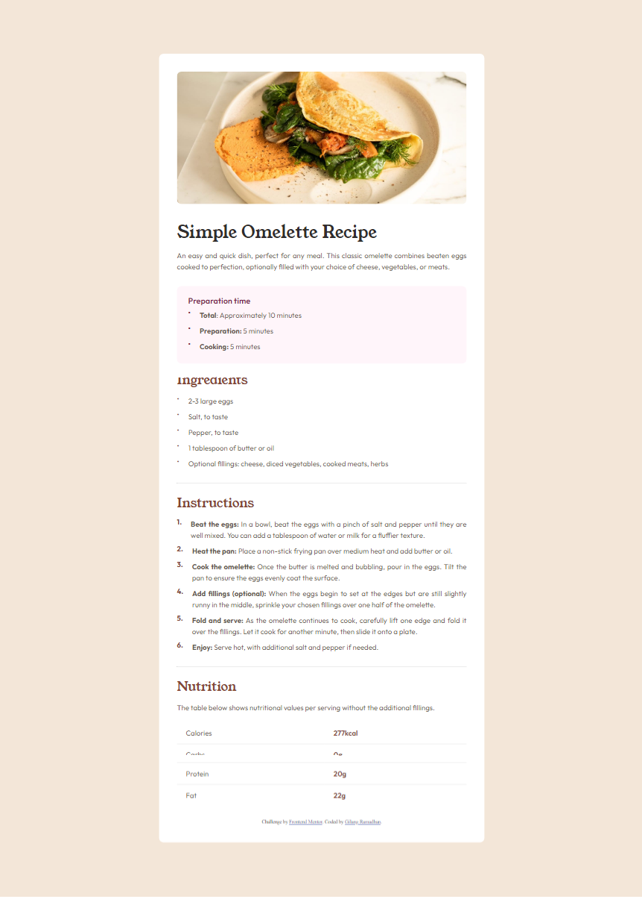

# Frontend Mentor - Recipe page solution

This is a solution to the [Recipe page challenge on Frontend Mentor](https://www.frontendmentor.io/challenges/recipe-page-KiTsR8QQKm). Frontend Mentor challenges help you improve your coding skills by building realistic projects.

## Table of contents

- [Overview](#overview)
  - [The challenge](#the-challenge)
  - [Screenshot](#screenshot)
  - [Links](#links)
- [My process](#my-process)
  - [Built with](#built-with)
  - [What I learned](#what-i-learned)
  - [Useful resources](#useful-resources)
- [Author](#author)

## Overview

### The Challenge

Your challenge is to build out this recipe page and get it looking as close to the design as possible.

You can use any tools you like to help you complete the challenge. So if you've got something you'd like to practice, feel free to give it a go.

Want some support on the challenge? Join our community and ask questions in the #help channel.

### Screenshot

### Links

- Solution URL: [Add solution URL here](https://gilangr1440.github.io/gilangr-recipe-page-main/)

## My process

### Built with

- Semantic HTML5 markup
- CSS custom properties
- Flexbox
- Responsive web with media query

### What I learned

I have learned how to use headings correctly and add landmarks to content.

### Useful resources

- [Example resource 1](https://dequeuniversity.com/rules/axe/4.6/heading-order?application=axeAPI) - It helps me how to use headings properly.
- [Example resource 2](https://dequeuniversity.com/rules/axe/4.6/region?application=axeAPI) - This page tells me that every content should be contained by landmarks.

## Author

- LinkedIn - [Gilang Ramadhan](https://www.linkedin.com/in/gilangr1440/)
- Frontend Mentor - [@gilangr1440](https://www.frontendmentor.io/profile/gilangr1440)
- Instagram - [@gilangr1440](https://www.instagram.com/gilangr1440/)
